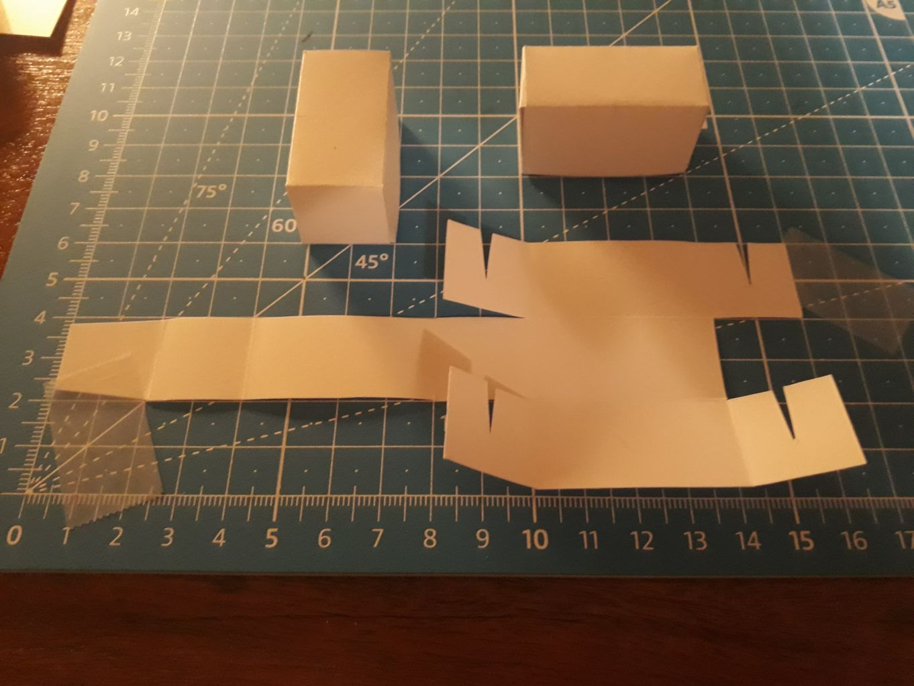
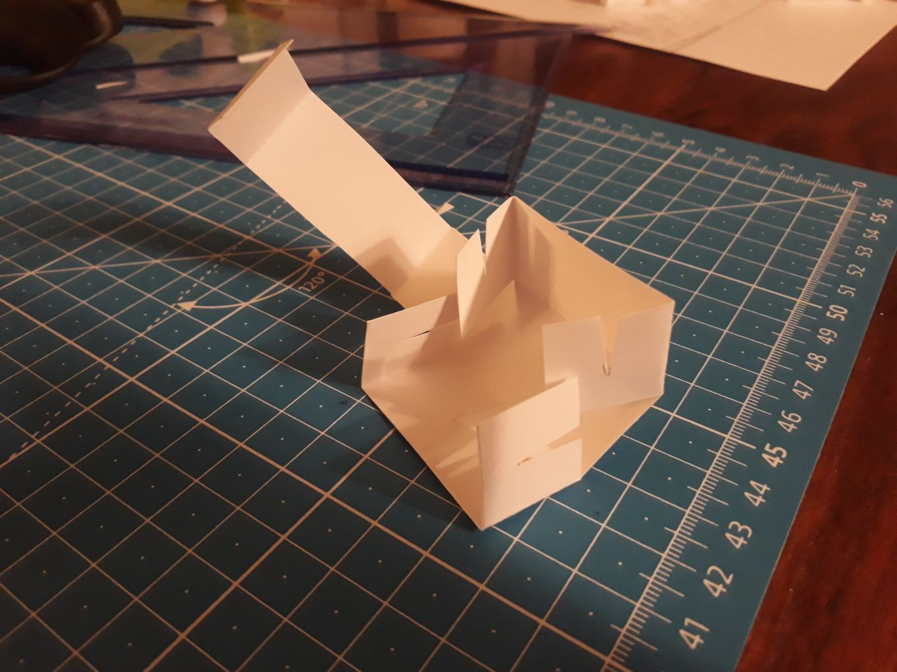
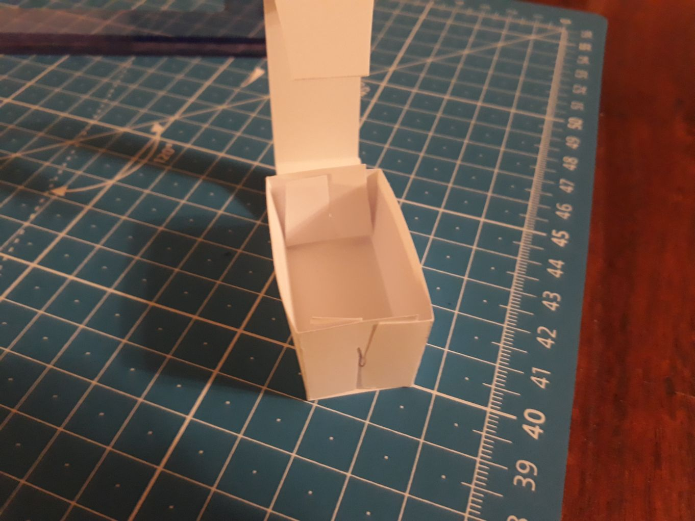
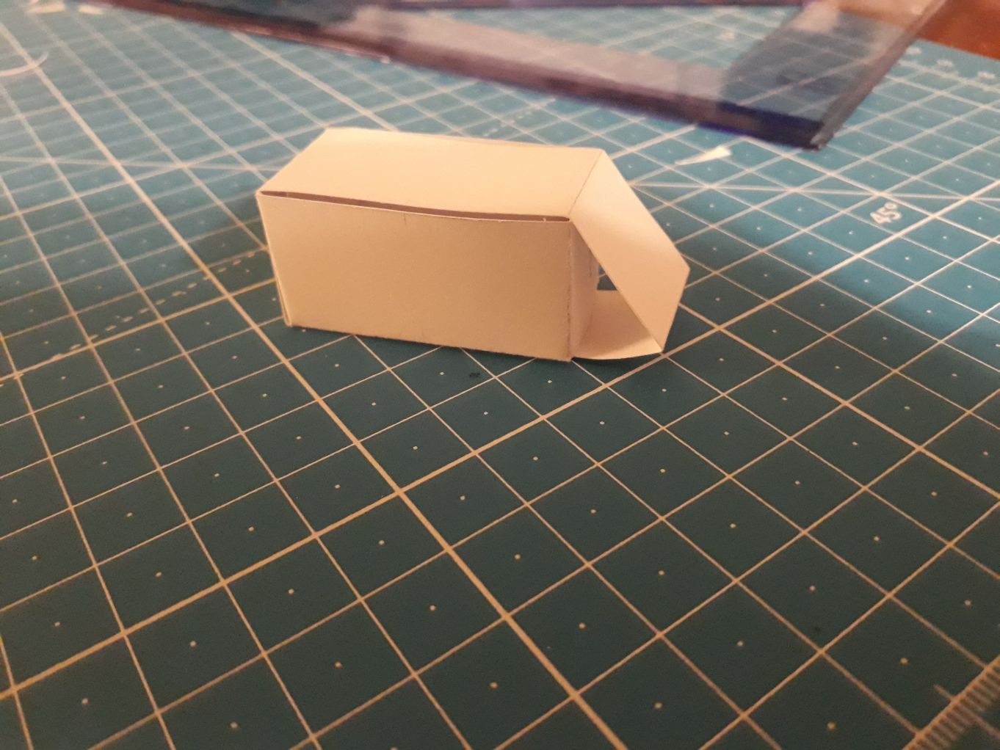
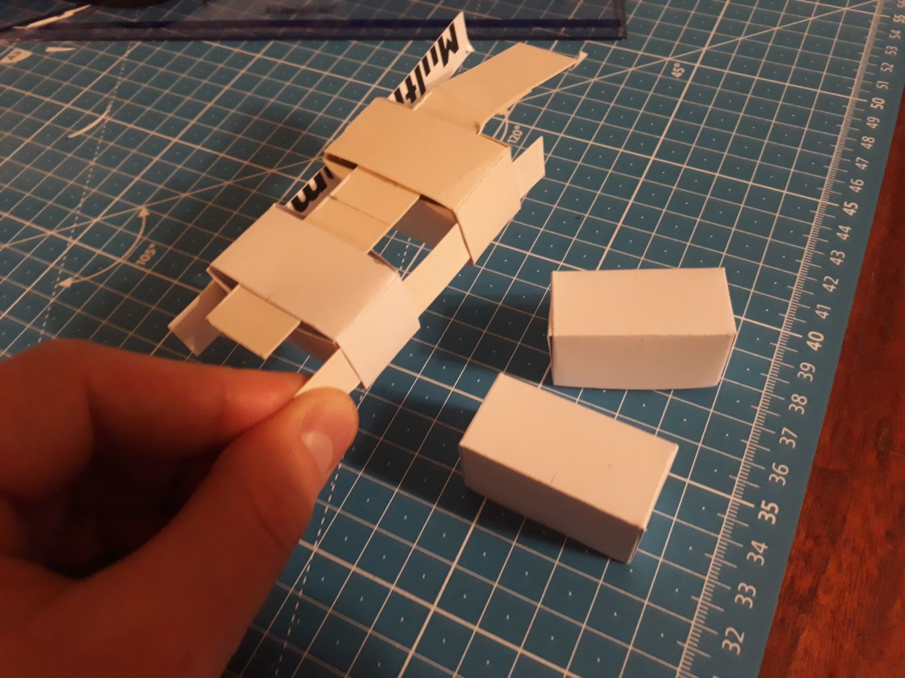

# A papercraft brick.

Instructions for a cuboid made from a sheet of paper, with no glue used.
The construction seems to quite robustly keep a decent shape,
and to lend itself nicely to some friction-based connectivity by weaving strips of paper under its walls.

```pikchr:render
line 400% 
line left
line up

define cutout {
 right
 line 45%
B: move 10%
C: line 45%
D: move from B.c down 60%
 line from B.w to D.s
 line from B.e to D.s
 move to C.e; right
}

cutout
line right 200%
cutout
line down; line left; line down
cutout
line down; O1: line left 400%; line up
cutout
line left 400%
K: move left
L: move up 10%
line from K.start to L.end
line up 80%
M: move up 10%
N: move right
line from M.start to N.end

line dashed .04 down
move right
line dashed .04 up
move right 200%
line dashed .04 down
move right
line dashed .04 right 200%
move up
line dashed .04 left 200%
move up
line dashed .04 down 300%
O2: move right 200%
O3: line dashed .04 up 300%

X1: line thin color gray from 2mm below O1.w down 50%
X2: line same from 2mm below O2.w
X3: line same from 2mm below O3.s
text "1cm" at (1/2<X1,X2>,6/8<X1.start,X1.end>)
line thin color gray from previous text.w left until even with X1 ->
line same from previous text.e right until even with X2
text "2cm" at (1/2<X2,X3>,6/8<X2.start,X2.end>)
line same from previous text.w left until even with X2
line same from previous text.e right until even with X3
```

The specimens presented below are ~2x2x4cm after folding,
but the idea should work with other dimensions as well (I intend to try 2x2x2cm next).
The paper I used is mostly 190gsm.

After drawing a grid of 2x2cm squares, I was able to get 6 cutouts of the brick from a sheet of A4 paper.









The image below shows how the bricks can be connected by weaving strips of paper under their walls.
The gaps visible in the image below can be hidden by rotating the assembly &mdash;
I'm showcasing them here to make it more clear how to do the weaving.
Alternatively, some smarter connecting pieces could also possibly conceal them.


