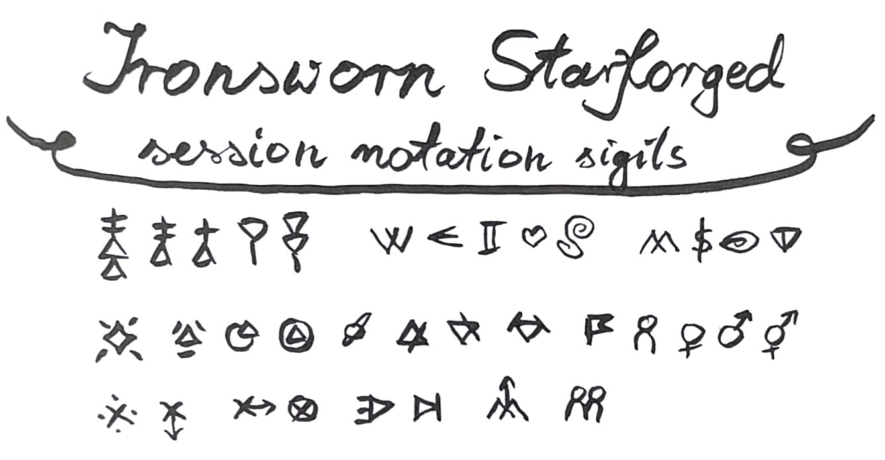
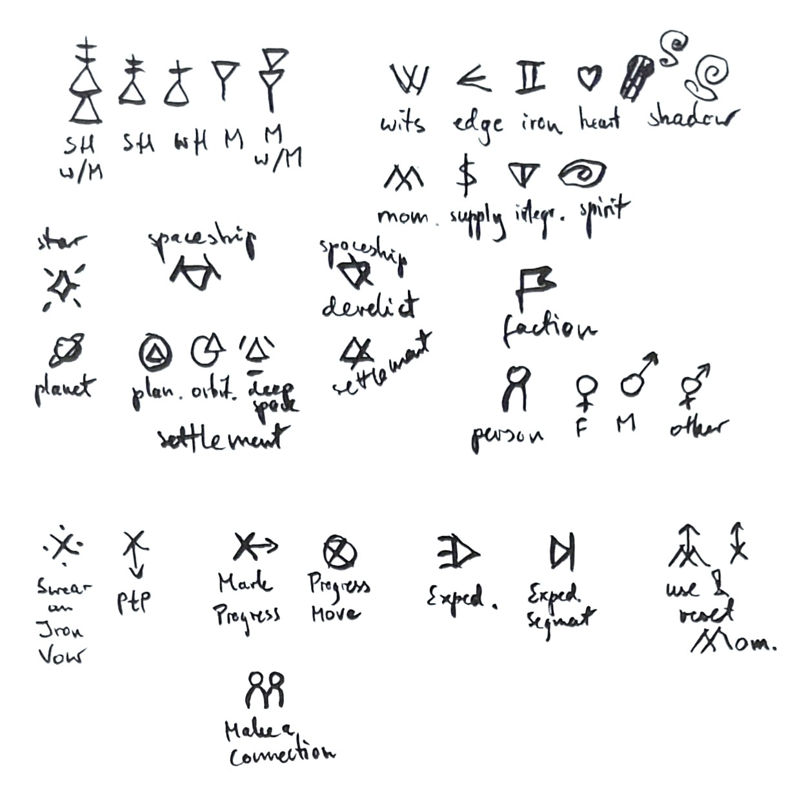
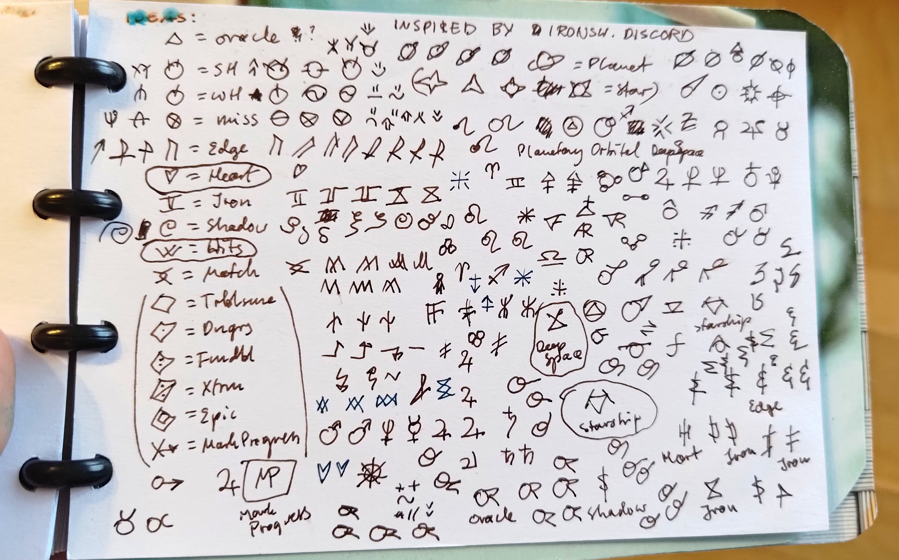
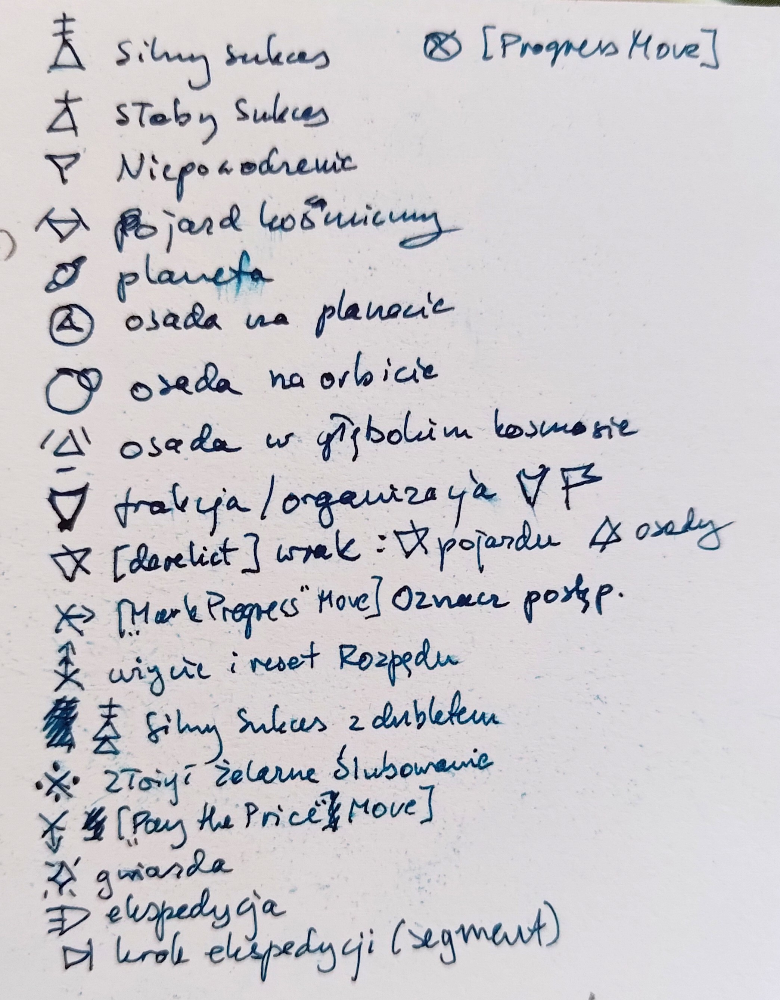
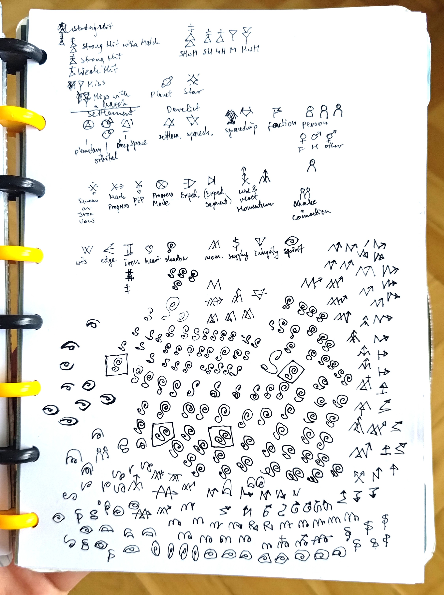
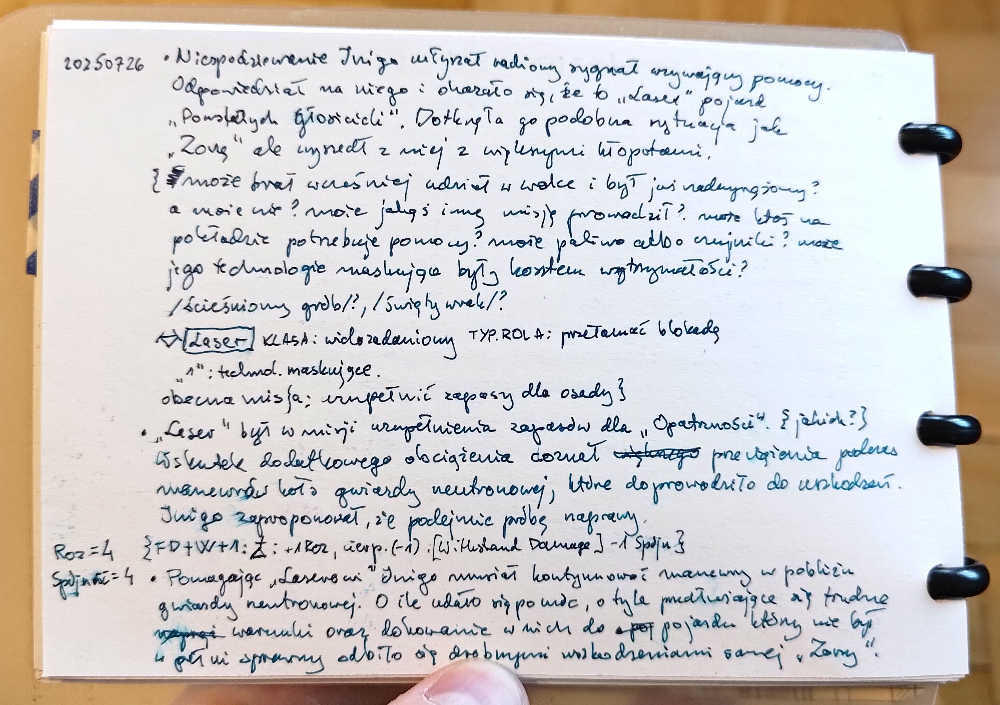
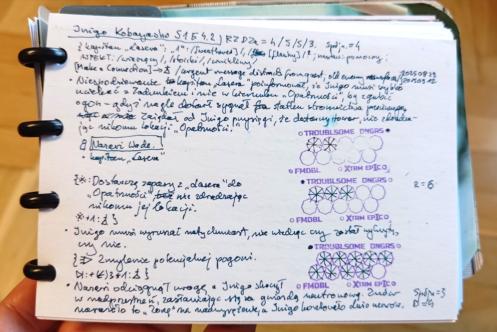

# _Ironsworn: Starforged_ session notation sigils

The sigils cover a variety of technical terms/concepts
in _Ironsworn: Starforged_,
that I found I use commonly in my journaling of this game
(for a visual explanation, see an image below).
Notably, this includes:
  - mechanical stuff:
    - roll results (e.g. Strong Hit; Miss with a Match)
    - character stats (e.g. Edge, Heart, Iron)
    - condition meters (e.g. Momentum, Spirit) - note:
      I haven't invented a sigil for Health yet!
      it's not easy when a heart is already occupied by the Heart stat...
    - some notable moves
      (e.g. Swear an Iron Vow; progress-related; expedition-related)
    - some other commonly encountered and noteworthy mechanical stuff
      (e.g. Momentum reset; a progress move of any kind).
  - world stuff:
    - space encounters - especially the notable ones,
      that I would want to mark on a map
      (Planets; Settlements; Derelicts; Stars)
    - notable actors (NPCs) I interact with
      (Persons; Factions)

An annotated list of the sigils, in a graphical form:

 {.showcase}

The whole idea was inspired by someone's post
on the Ironsworn discord
(unfortunately I no longer remember whose).
Big thanks to the person who shared that idea!
(If you're the person, or know who that was
and can send me a link to prove it,
I'd be super grateful and happy to update this post!
The best way to reach me is probably on mastodon
as [@akavel@merveilles.town](https://merveilles.town/@akavel),
or on Ironsworn discord as `@akavel.`
I'm also happy to add links to other such systems
you might know!)

As an extra, here are various drafts and in-progress sketches and notes
I made while designing and testing the sigils:

And below you can see some examples of using them in actual gameplay notes:

_(By the way -_
_should you be curious about the progress track in the last image,_
_it's my other creation: [Starforged Vows stamp](https://akavel.itch.io/starforged-vow-stamp).)_

[💬 Discuss.](https://merveilles.town/@akavel/116499309338633368)

