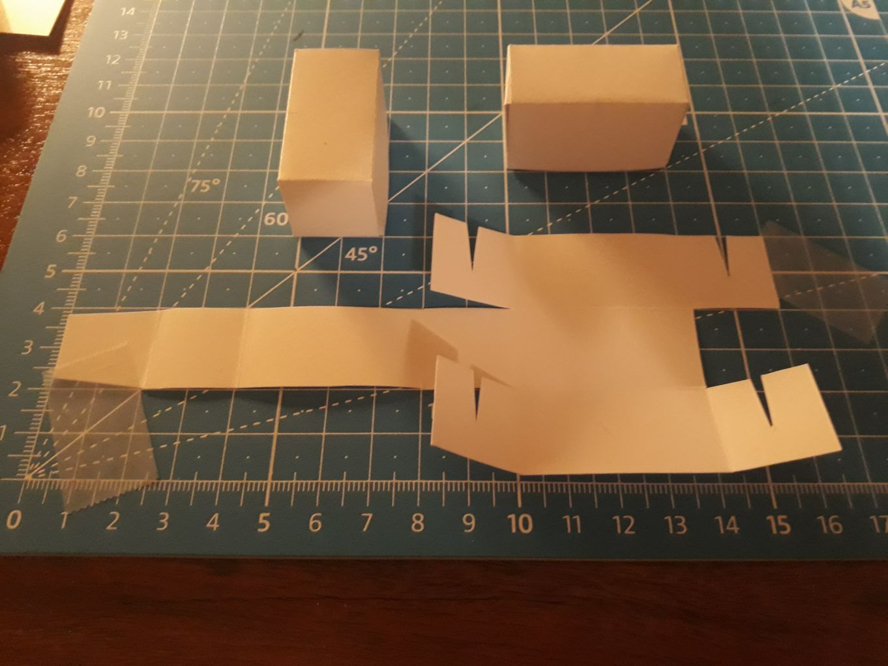
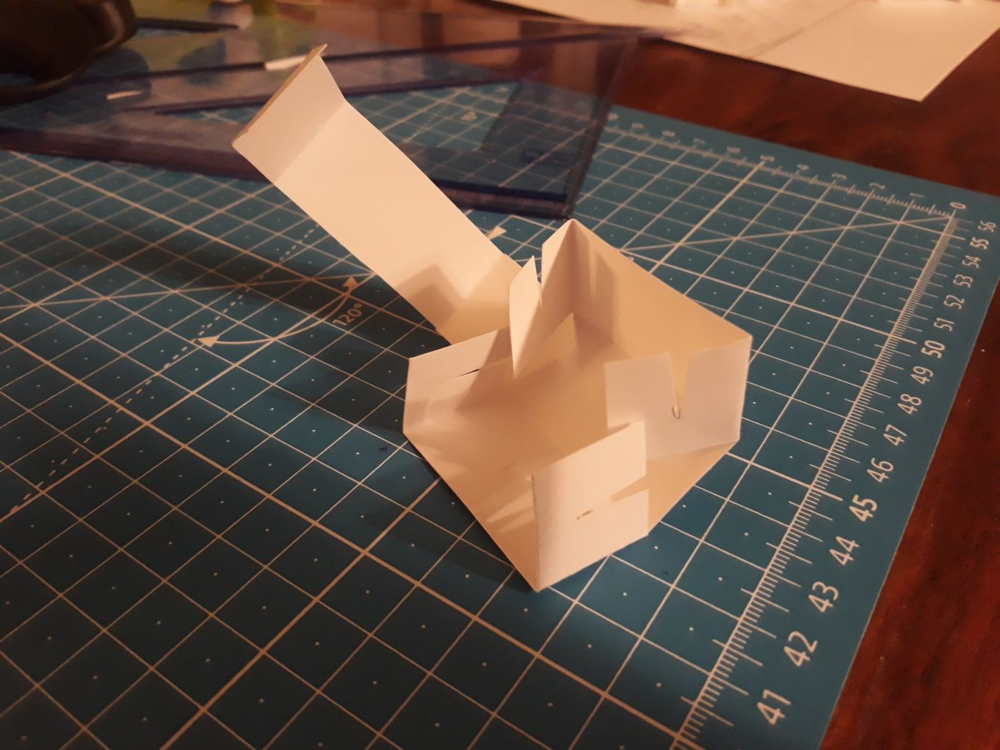
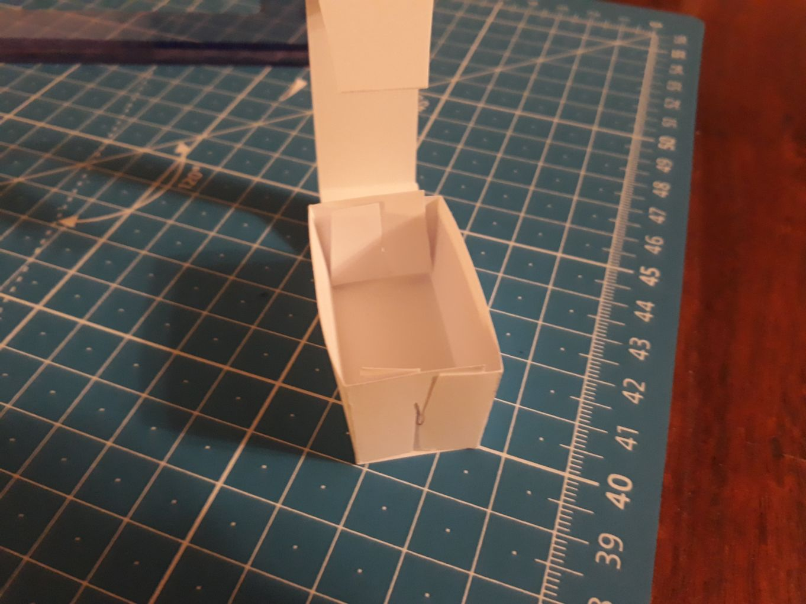
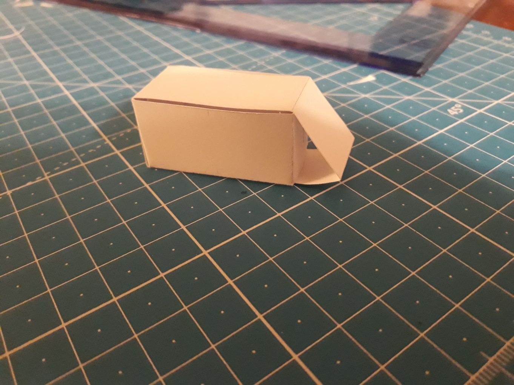

# A papercraft brick.

Instructions for a cuboid made from a sheet of paper, with no glue used.
The construction seems to quite robustly keep a decent shape,
and to lend itself nicely to some friction-based connectivity by weaving strips of paper under its walls.

The specimens presented below are ~2x2x4cm after folding,
but the idea should work with other dimensions as well (I intend to try 2x2x2cm next).
The paper I used is mostly 190gsm.

After drawing a grid of 2x2cm squares, I was able to get 6 cutouts of the brick from a sheet of A4 paper.

The image below shows how the bricks can be connected by weaving strips of paper under their walls.
The gaps visible in the image below can be hidden by rotating the assembly &mdash;
I'm showcasing them here to make it more clear how to do the weaving.
Alternatively, some smarter connecting pieces could also possibly conceal them.

