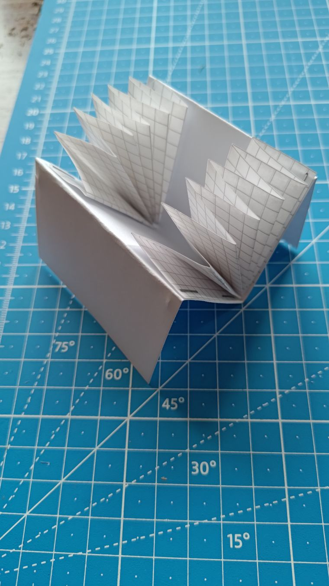
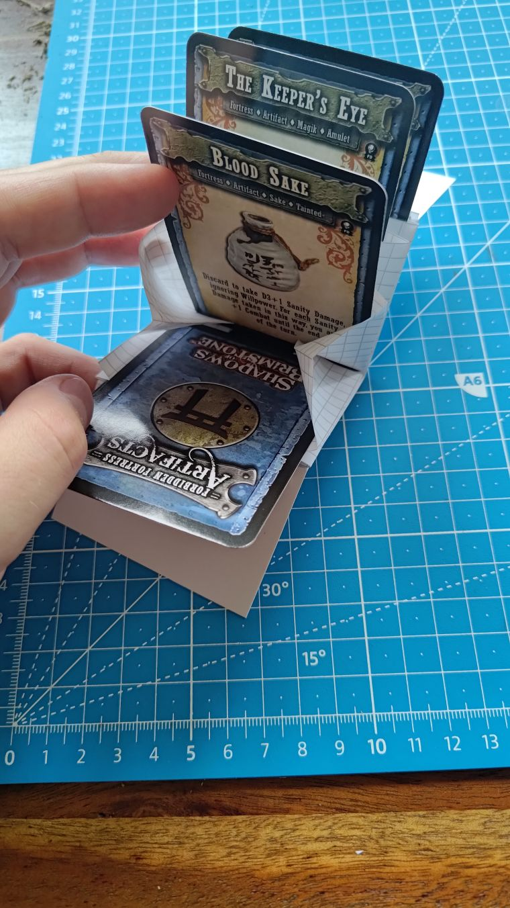
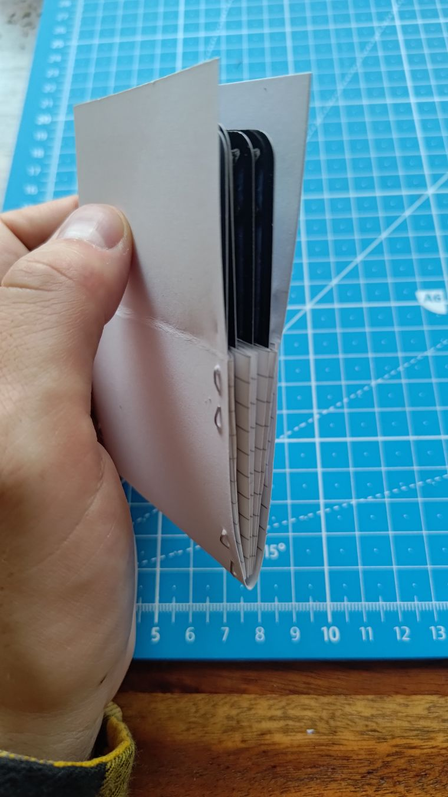
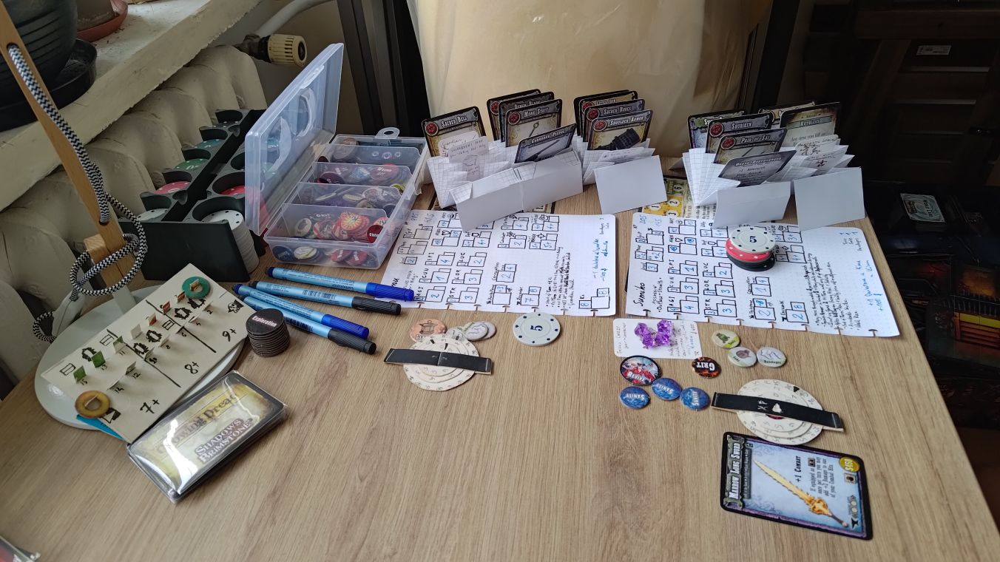

# Shadows of Brimstone: DIY card-holder

"Harmonicas":
1. Cut two ROUGHLY **5x30cm** (2x12in) strips of grid paper — on 0.5cm A4 paper, that means **10 grids** wide strip off the long edge.
2. Bend each of them into a "harmonica" at **~2.5cm** (~1in) intervals — on 0.5cm grid, that means **5 grids**.

"Cover":
1. Cut **~7x20cm** (~2¾ x ... in) strip of cardboard paper.
2. Bend it in half to get two 7x10cm covers.
3. Staple the "Harmonicas" inside the covers.
4. Bend the covers outside where the "Harmonicas" end.

(based on [a DIY card wallet on instructables](https://www.instructables.com/Accordion-Style-Card-Wallet/))

