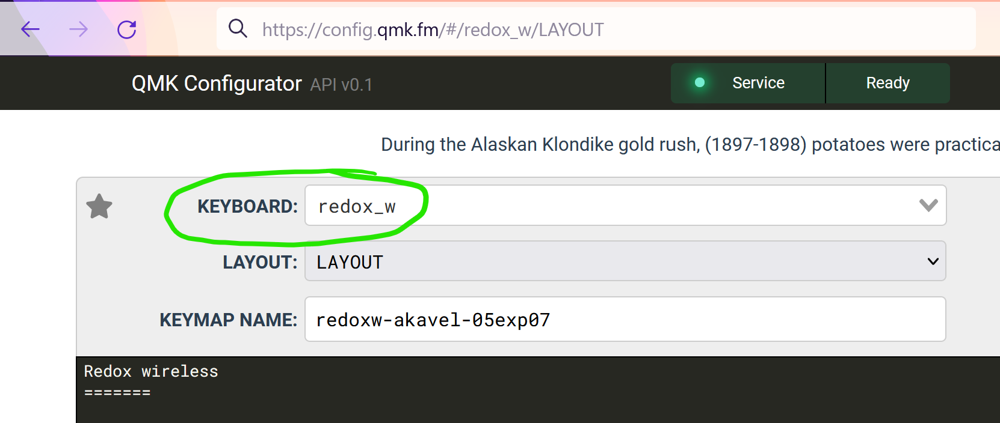
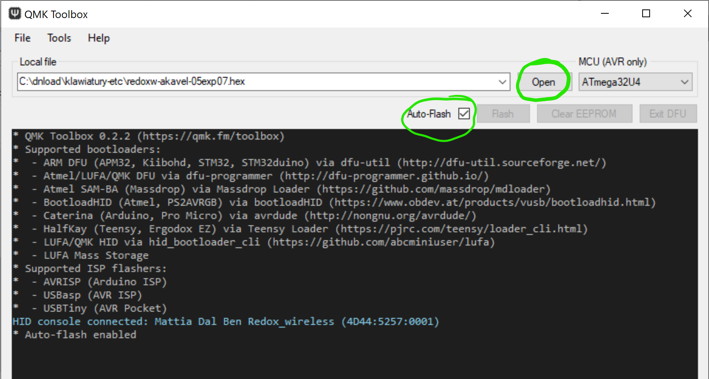

# Applying a custom layout in a Redox Wireless keyboard

Yesterday I pulled out my Redox Wireless from the closet. I [purchased it](https://falba.tech/19644-2/) during the pandemic after thinking of—but failing to—build a DIY ergonomic keyboard for many years. I tried to learn its layout once already, by means of a [game][]. I was only partially successful however, as the game does not support non-letter characters (still, it was fun and probably taught me something). It took me a while before I tried again, but this time I got another idea: to print the layout from the QMK Configurator website, and keep it with me for reference.

On this second try, I quickly got a feeling that I really want to change the layout in various ways. My fingers seemed to just have their own ideas as to where some of the keys should be placed. I marked the printout with some notes and decided I want the changes bad enough to risk trying to flash the device with some customized firmware, for the first time in my life.

Below, I want to try and document especially those aspects of the procedure which were not super obvious to me, in case they might help someone else in a similar situation.
 
[game]: http://www.epistorygame.com/


## Step 1: Designing a custom layout of keys

I already played a bit with the [QMK Configurator online tool][cfg] before. Thus I knew, that the first thing I need to do, is to find the `Keyboard` field, and select the `redox_w` keyboard there — this is the codename used throughout the QMK set of tools to refer to the [Redox Wireless keyboard][redoxw].



[redoxw]: https://github.com/mattdibi/redox-keyboard/tree/1ba788b0fee34c757ecb16d632d9c9d8d463de16/redox-w#redox-w-wireless
[cfg]: https://config.qmk.fm/#/redox_w/LAYOUT

The rest of the tool, for me at least, seemed fairly intuitive. The only aspects that were not super obvious initially, were that to download the `.hex` file with the compiled firmware, I needed first to press the `[Compile]` button. After I did this, the `[Firmware]` button unlocked, and I could click it to download the `.hex` file.

To have a backup copy of the customized layout, it's also useful to download a `.json` file with the design. This can be done through clicking the button on the left of the `keymap.json` label. Due to some unexpected circumstances, in the end the `.json` file with the keymap would show up to be quite useful for me in the later steps of this story.


## Step 2: Flashing the custom layout (success… but failure)

Flashing the downloaded `.hex` file proved to be much less obvious, even with the awesome set of tools provided by the QMK project. I don't really want to think how much effort it would require *without* those tools, and I'm super grateful to all the contributors of QMK for making it what it is now!

[qmkt]: https://github.com/qmk/qmk_toolbox/releases/latest

As to what I did specifically in my case: (note that my main personal machine is on Windows)

1. First, I downloaded the [QMK Toolbox][qmkt] (version 0.2.2 at the time of writing, thus `qmk-toolbox-0.2.2.exe`)
2. Initially, I tried running it by normal double-clicking; this seemed to work allright at first glance, but then I encountered some weird errors when trying to flash the device. Based on my past experiences with Windows applications trying to do low-level stuff, I thought I may have better chances if I try to use **"Run as administrator"** with it. Which is what I did every time since (actually, I configured it through the Windows properties for the app, to not forget about it).
3. There are two important things I needed to do in the app:

      
      
      First, it's crucial to make sure that the `Auto-flash [x]` checkbox is on. The reason for this, is that the default bootloader of the keyboard is configured with a very short window of time when it allows uploading new firmware. Thus, the only way to try to fit in that window (and even this not always succeeds) is by selecting this option.
      
      Secondly, a `.hex` file with the firmware to upload needs to be selected using the `[Open]` button.
      
5. I found it would sometimes help if I [unplugged the keyboard at this point, and plugged it back in](https://github.com/qmk/qmk_firmware/issues/6133#issuecomment-549153226). Eventually, if the device was programmed with the default firmware, the following message would show up in the app's window:

        HID console connected: Mattia Dal Ben Redox_wireless (FEED:6060:0001)

6. Now, the moment all this stuff before was only a preparation for: I pressed the hardware button near the center of the the wireless receiver dongle of the keyboard.
7. Next, I waited for the firmware to hopefully flash successfully. Quite often the QMK Toolbox wouldn't detect the reset button fast enough, and wouldn't manage to flash it. In such case, I would try to repeat it a number of times, usually unplugging the device from the USB port and plugging it back between the tries, then waiting for a few seconds. A successful flash would result in several messages like below:

```
Attempting to flash, please don't remove device
> 
> Connecting to programmer: .
> Found programmer: Id = "CATERIN"; type = S
>     Software Version = 1.0; No Hardware Version given.
> Programmer supports auto addr increment.
> Programmer supports buffered memory access with buffersize=128 bytes.
> 
> Programmer supports the following devices:
>     Device code: 0x44
> 
> avrdude.exe: AVR device initialized and ready to accept instructions
> 
> Reading | ################################################## | 100% 0.00s
> 
> avrdude.exe: Device signature = 0x1e9587 (probably m32u4)
> avrdude.exe: NOTE: "flash" memory has been specified, an erase cycle will be performed
>              To disable this feature, specify the -D option.
> avrdude.exe: erasing chip
> avrdude.exe: reading input file "C:\dnload\klawiatury-etc\redox_w_redoxw-akavel-01.hex"
> avrdude.exe: writing flash (22798 bytes):
> 
> Writing | ################################################## | 100% 1.74s
> 
> avrdude.exe: 22798 bytes of flash written
> avrdude.exe: verifying flash memory against C:\dnload\klawiatury-etc\redox_w_redoxw-akavel-01.hex:
> avrdude.exe: load data flash data from input file C:\dnload\klawiatury-etc\redox_w_redoxw-akavel-01.hex:
> avrdude.exe: input file C:\dnload\klawiatury-etc\redox_w_redoxw-akavel-01.hex contains 22798 bytes
> avrdude.exe: reading on-chip flash data:
> 
> Reading | ################################################## | 100% 0.20s
> 
> avrdude.exe: verifying ...
> avrdude.exe: 22798 bytes of flash verified
> 
> avrdude.exe: safemode: Fuses OK (E:FB, H:D8, L:FF)
> 
> avrdude.exe done.  Thank you.
> 
Flash complete
```

Unfortunately, after reconnecting the keyboard, it wouldn't work. I tried pressing various keys, but nothing happened.

## Step 3: Flashing the original firmware.

Fortunately for me, [the original firmware is available online](https://github.com/mattdibi/redox-keyboard/blob/1ba788b0fee34c757ecb16d632d9c9d8d463de16/redox-w/firmware/qmk_redox_w_default.hex). After repeating the procedure from the "Step 2: Flashing..." section above, I was happy to see the keyboard responding again.

## Step 4: Debugging

Given that I knew that the original firmware worked, I wanted to see if I could compile some older version of QMK and get it to work after flashing. Seeing that this would require installing more complex dependencies, but also noticing that the `qmk_firmware` repository contains a `shell.nix` file in its root directory, I switched to my secondary Linux machine with Nix. (In fact, it is specifically NixOS.)

After copying the `keymap.json` file from "Step 1" to the machine, the commands I would execute were:

```
$ git clone https://github.com/qmk/qmk_firmware
$ cd qmk_firmware
$ git checkout c0bb15315170f9265143833ad879b7c8f87b06ac  # last good
$ nix-shell   # NOTE: easy, but took a few hours the first time...
$ make git-submodule  # via: https://redd.it/d1l4d7
$ DIR=keyboards/redox_w/keymaps/akavel
$ mkdir -p "$DIR"
$ qmk json2c keymap.json > "$DIR/keymap.c"
$ qmk compile -kb redox_w -km akavel  # https://docs.qmk.fm/#/newbs_building_firmware
```

This resulted in a file named `redox_w_akavel.hex` being created in the working directory.

After copying the new `.hex` file back to the Windows machine, I tried flashing it to the keyboard — and it worked! 🎉

(Note: the specific commit listed in the snippet above was not something I magically discovered; I tested a number of recent commits that changed the `redox_w` directory in the repository.)

## Extras: LEDs

The receiver dongle of the Redox Wireless keyboard (i.e. the thing that is actually plugged into the USB port of the computer) comes with 4 LEDs. Interestingly, the QMK Configurator online tool does not seem to currently support this feature, as far as I know. To use it, a snippet like below [needs to be added](https://github.com/mattdibi/redox-keyboard/issues/93#issuecomment-1073316313) to the `keymap.c` file before the `qmk compile` command is executed:

```
$ cat >> "$DIR/keymap.c" <<EOF

layer_state_t layer_state_set_user(layer_state_t state) {
    switch (get_highest_layer(state)) {
        case 0:
            /* set_led_off; */
            blu_led_off;
            grn_led_off;
            red_led_off;
            break;
        case 1:
            blu_led_on;
            grn_led_off;
            red_led_off;
            break;
        case 2:
            blu_led_off;
            grn_led_on;
            red_led_off;
            break;
        case 3:
            blu_led_off;
            grn_led_off;
            red_led_on;
            break;
        default:
            break;
    }
  return state;
}

bool led_update_user(led_t led_state)
{
    if (led_state.caps_lock) {
        wht_led_on;
    } else {
        wht_led_off;
    }
    return false;
}
EOF
```

## Extras: Issue report

After I tracked the breaking commit, I opened an issue on the `qmk_firmware` repository. It got quickly and correctly closed as a duplicate of an existing issue [#16553](https://github.com/qmk/qmk_firmware/issues/16553). It shows up that more people tracked this down before too, and even started working on some potential fix PRs. Since then, when building my subsequent layout revisions, I switched to using the `master` branch, merged by hand with [PR #17203](https://github.com/qmk/qmk_firmware/pull/17203) (`git fetch origin pull/17203/head:pr17203; git merge pr17203`). Seems to work fine for me as well!
